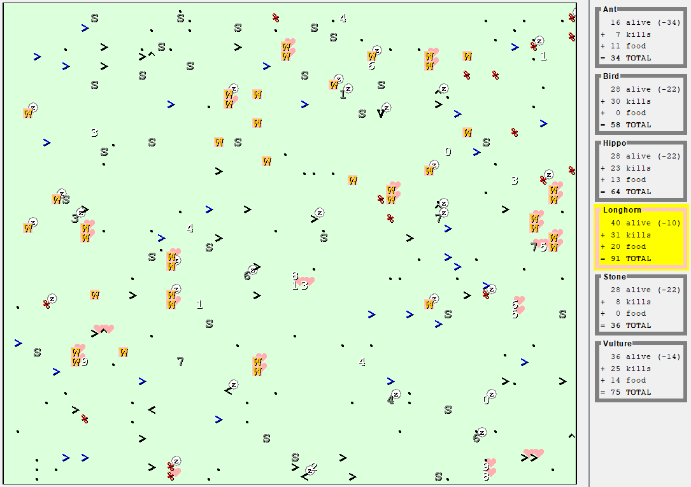
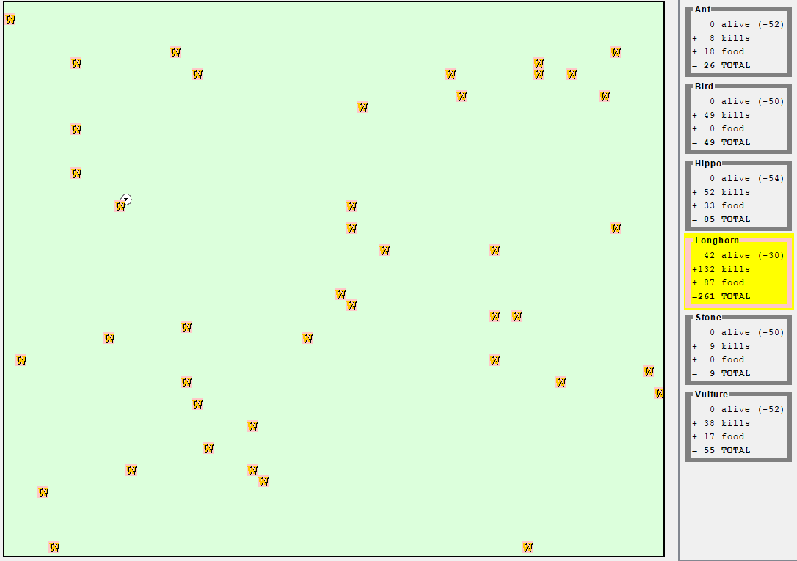

# Critters



**Critters** is a simulation program that is based off of [**Conway's Game of Life**](https://en.wikipedia.org/wiki/Conway%27s_Game_of_Life).
The simulation consists of grid-based environment that many creature programs can interact with. More specifically, creatures can *mate*, *fight*, or *eat*
to increase their group score. Creatures can mate once with another creature to create another creature. They can also fight with other creatures in rock-paper-scissors
based combat. Lastly, eating inolves finding pellets that are found on the ground.

----

## Implemented Creatures

(*Fighting Note:* ROAR > SCRATCH, SCRATCH > POUNCE, POUNCE > ROAR)

* **Stone:** Doesn't Move. Attacks with ROAR.

* **Ant:** Moves either up or down, the direction being chosen at intialization. Attacks with SCRATCH.

* **Bird:** Doesn't eat and moves in a circle around starting position. Always defeats ants and POUNCES on other enemies.

* **Vulture:** Performs similar to a bird, except that it also eats.

* **Hippo:** Moves in random directions. Attacks differently depenending on whether it's hungry or not (decided internally).

* **Longhorn:** Implemented to have a higher-level of intelligence than other creatures. Longhorns always mate when first placed on the environment. Once mated,
the longhorns follow a movement pattern that allows them to cover every cell of the board. They have a fighting pattern that alters based on previous battles in the current
simulation.


**Due to being drastically complex compared to the other creatures, longhorns will always win when they have a fair starting count.**

----

## Running the Simulation
1. Compile all creatures that you wish to use in the simulation.
```
  javac <critter>.java
```

2. Compile the main simulation program.
```
  javac CritterMain.java
```

3. Run the program and select the creatures you wish to use, as well as the size of the environment.
```
  java CritterMain
```
